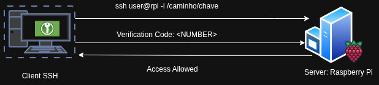

# Implementação de Autenticação 2FA via KeePassXC

Segundo a documentação do [Arch Linux](https://wiki.archlinux.org/title/Google_Authenticator#Usage), o **Google Authenticator** permite habilitar autenticação em dois fatores (2FA) utilizando **OTP** (_One-Time Password_).

A cada 30 segundos, um token de 6 dígitos é gerado por um aplicativo autenticador, como o **Google Authenticator**, por exemplo.

Esse token deve ser fornecido durante o login, tanto no desktop quanto, como no nosso caso, ao tentar se conectar a uma máquina remota via SSH.

---

## Cenário



No cenário deste exemplo, o host no qual realizaremos as configurações de segurança do SSH será o **Raspberry Pi**.

No PC cliente (_SSH Client_), será necessário apenas importar a **Chave Secreta** em um aplicativo compatível com 2FA para receber os tokens gerados pelo servidor.

---

## Passo 0: Atualize o sistema e as dependências

Acesse o host remoto, no nosso cenário é o **Server Rasberry Pi**.

```
sudo apt update -y
sudo apt upgrade -y
```

---

## Passo 1: Instale as dependências

```
sudo apt install libpam-google-authenticator qrencode -y
```

---

## Passo 2: Configurar o PAM

No arquivo **/etc/pam.d/sshd**, adicione a seguinte linha:

```
auth required pam_google_authenticator.so
```


---

## Passo 3: Configurar o SSHD

No arquivo **/etc/ssh/sshd_config**, adicione ou ajuste as seguintes linhas:

```
# Google Authenticator Configuration

AuthenticationMethods publickey,keyboard-interactive

KbdInteractiveAuthentication yes

ChallengeResponseAuthentication yes

UsePAM yes

PubkeyAuthentication yes
```

Depois, verifique se as opções **UsePAM** e **PubkeyAuthentication** estão habilitadas:

```
sudo egrep "UsePAM|PubkeyAuthentication" /etc/ssh/sshd_config
```

Saída esperada:

```
PubkeyAuthentication yes
UsePAM yes
```

> Dependendo da versão do OpenSSH, `ChallengeResponseAuthentication` pode estar obsoleto. Em versões mais recentes, utilize preferencialmente `KbdInteractiveAuthentication yes`.

Após realizar as alterações, reinicie o serviço SSH:

```
sudo systemctl restart ssh
```

---

## Passo 4: Executar o Google Authenticator

Execute o comando abaixo no usuário que realizará o login via SSH:

```
google-authenticator
```

Durante a configuração:

- responda `y` para gerar o arquivo de autenticação;
- responda `y` para atualizar o arquivo `.google_authenticator`;
- responda `y` para habilitar proteção contra reutilização de token;
- responda `y` para aumentar a tolerância de tempo;
- responda `y` para habilitar _rate limiting_.

Ao final, será exibida:

- uma **QR Code**;
- uma **Chave Secreta** (essa chave secreta será importada no software compatível com 2FA, no nosso caso, KeePassXC);
- códigos de recuperação (_scratch codes_).

![[Demonstração]](./images/google-authenticator.png)

> Se você possui o Google Authenticator instalado no seu Smartphone, você pode escanear o QRCode.

---

## Integrar com o KeePassXC

Para quem prefere não depender do smartphone (especialmente em casos de perda, roubo ou dano) o que pode gerar um processo burocrático para restaurar o acesso às contas e autenticações, é possível utilizar um software no próprio laptop ou PC utilizado no dia a dia para acesso remoto.

Uma opção prática é o uso do **KeePassXC**, que permite armazenar e gerar códigos **TOTP (Time-Based One-Time Password)** diretamente no computador.

Se você já possui o KeePassXC instalado e um banco de dados criado, siga os passos abaixo:

- Acesse seu **PC (Cliente SSH)**
- Abra a aplicação do KeePassXC e digite sua senha de acesso
- No menu superior, selecione **Entradas**
- Acesse **TOTP > Configurar TOTP**
- No campo **Chave Secreta**, insira a chave fornecida durante a configuração do autenticador
- Clique em **OK**

![[KeePassXC-Configuration]](./images/configure_totp_keepassxc.png)

Para visualizar o código gerado:

- Selecione **Entradas**
- Vá em **TOTP > Mostrar TOTP**

![[Code]](./images/totp_code.png)

---

## Testando a autenticação SSH

Ao conectar via SSH:

```
ssh usuario@ip-do-servidor
```

O sistema solicitará:

1. autenticação por chave pública;
2. código OTP gerado no aplicativo autenticador.

Exemplo:

```
Verification code:
```

![[Acesso]](./images/teste_acesso.png)